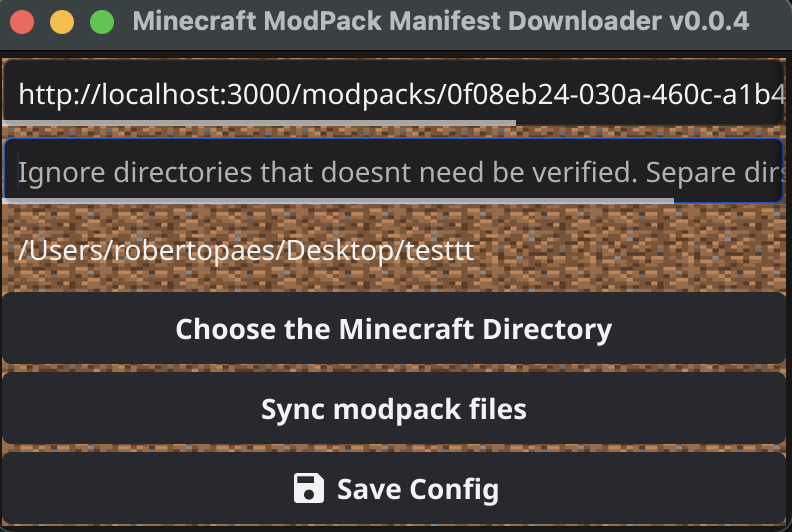

# Minecraft ModPack Manifest Downloader

## A simple app to be used with boberto api remake to sync local files with modpack files. This means that you can play at a modpack server without any mod wrong versions.

This project uses [api-launcher-boberto-remake](https://github.com/brutalzinn/api-launcher-boberto-remake)

This project is just a suppose project to test availability of using Go to developer frontend applications.

## Mac OSX Screenshot

.

# Features

* Download modpack files using boberto manifest
* Remove local files that doesnt coantains at manifest
* Simple UI to just click one button and start fun!
* Choose a folder to download the modpack files. This means that you can use any launcher of you preference and enjoy the same experience of boberto launcher.
* Check files using Sha1 to ensure security and file availability.